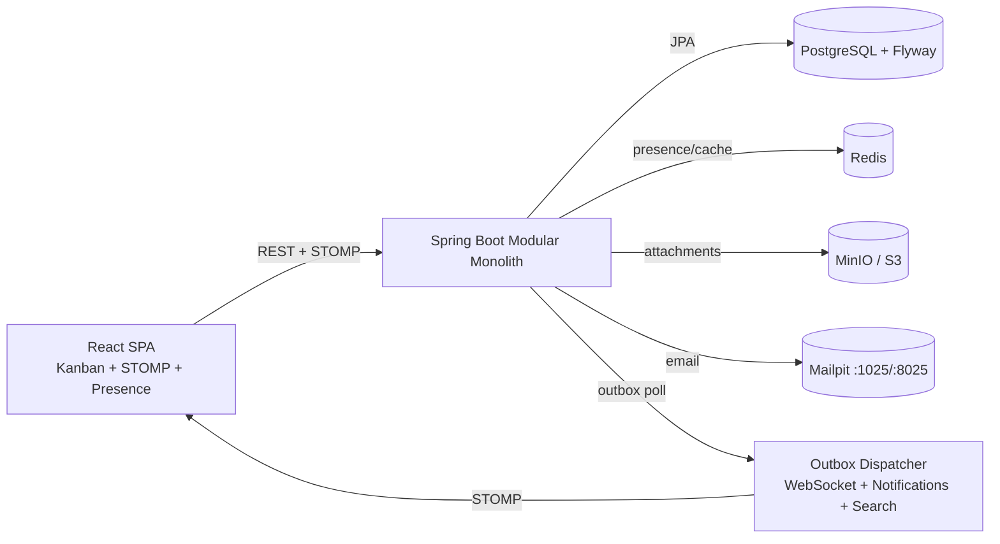

# OrbitFlow — Multi-User Collaborative Project Hub

Modular-monolith team collaboration platform (Trello + Jira + lightweight docs): workspaces, projects,
Kanban boards with LexoRank ordering, tasks with optimistic locking, comments with mentions, documents
with revisions, S3 attachments, real-time STOMP sync with presence, notifications, search, reporting,
activity audit timeline, and a transactional outbox for durable side effects.

## System Architecture



Request flow: Controller + DTO validation → JWT auth + `WorkspaceSecurityPolicy` → `@Transactional`
use case → domain rules (WIP, workflow, rank) → repository commit + `outbox_events` row in the
**same transaction** → async `OutboxService.poll` (`SELECT … FOR UPDATE SKIP LOCKED`, H2 fallback)
publishes Spring events → `RealtimePublisher` (monotonic revision), `NotificationService`, search.

## Quickstart

```bash
# 1. Start infrastructure
docker compose up -d postgres redis minio mailpit

# 2. Run backend (Java 21 required)
./gradlew bootRun

# 3. Run frontend (new terminal)
cd frontend && npm install && npm run dev

# Open:
# - App:      http://localhost:5173
# - API docs: http://localhost:8080/swagger-ui.html
# - Mailpit:  http://localhost:8025
# - MinIO:    http://localhost:9001 (minioadmin / minioadmin123)
```

One-command full stack (after `./gradlew bootJar`):

```bash
docker compose up --build
```

## API Summary

Auth: `POST /api/v1/auth/register|login|refresh|logout`, `GET /api/v1/auth/me`.
Workspaces: `POST/GET /api/v1/workspaces`, `GET /api/v1/workspaces/{id}/members`,
`POST /api/v1/workspaces/{id}/invitations`, `POST /api/v1/invitations/{token}/accept`,
`PATCH/DELETE /api/v1/workspaces/{id}/members/{userId}`, `POST …/transfer`.
Projects: `POST /api/v1/workspaces/{wId}/projects`, `GET /api/v1/projects/{pId}`,
`POST /api/v1/projects/{pId}/archive`.
Boards: `GET /api/v1/boards/{bId}`, `GET /api/v1/projects/{pId}/board`,
`POST /api/v1/boards/{bId}/columns`, `PATCH /api/v1/boards/{bId}/columns/{cId}`.
Tasks: `POST /api/v1/projects/{pId}/tasks`, `GET/PATCH /api/v1/tasks/{tId}`,
`POST /api/v1/tasks/{tId}/move`, `POST …/archive`, `POST …/dependencies`,
`POST/DELETE …/watchers/me`, `GET …/activity`.
Comments: `POST/GET /api/v1/tasks/{tId}/comments`, `PATCH/DELETE /api/v1/comments/{cId}`.
Documents: `POST/GET /api/v1/projects/{pId}/documents`, `PATCH /api/v1/documents/{dId}`,
`GET /api/v1/documents/{dId}/revisions`, `POST …/restore/{n}`.
Attachments: `POST /api/v1/tasks/{tId}/attachments/reserve`,
`POST /api/v1/attachments/{aId}/complete`, `GET …/download`.
Search / notifications / activity / reporting:
`GET /api/v1/search?q=…`, `GET /api/v1/notifications`, `POST /api/v1/notifications/read`,
`GET /api/v1/workspaces/{wId}/activity`, `GET /api/v1/projects/{pId}/report|milestones`.

WebSocket: `CONNECT /ws` with `Authorization: Bearer <JWT>`, subscribe
`/topic/boards/{boardId}`, `/topic/projects/{projectId}`, `/topic/workspaces/{workspaceId}`,
`/user/queue/notifications`; publish heartbeats to `/app/presence/heartbeat`.

## Concurrency & LexoRank

- Every `Task` and `BoardColumn` carries `@Version`. Mutations require `expectedVersion`;
  stale writes return `409 Conflict` with `currentState` so the UI can merge (see `OptimisticLockTest`).
- Project-scoped keys (`PH-142`) allocate via `PESSIMISTIC_WRITE` lock on the project row
  (`nextTaskNumber`), safe under concurrent creation.
- Card order uses fractional string ranks (`LexoRank.between/increment/decrement`):
  drag-and-drop computes a midpoint between neighbours in O(1) without re-indexing the column.
  `needsRebalance` triggers a column renumber preserving visible order when ranks grow past 16 chars.

## Authorization

Centralized `WorkspaceSecurityPolicy` (Owner > Admin > Member > Guest) is enforced on REST,
WebSocket `SUBSCRIBE` (`WebSocketAuthChannelInterceptor`), downloads, search, and jobs.
Tenant isolation = every query scoped by `workspaceId` + membership check; never authorize from a
bare resource UUID. Cross-workspace access is covered by `TenantIsolationTest`/`SecurityAccessTest`.

## Notifications & Search

- Mentions (`@username`) are extracted, access-checked, deduplicated (one row per
  `eventType:resource:recipient`), self-mentions excluded. Email goes via `MailService`
  (Mailpit in prod, in-memory capture in tests).
- Due-date reminders run as a bounded database query (`findUpcomingDueTasks`, 200/batch);
  digests aggregate by recipient.
- Search executes workspace-scoped, paged JPQL (`searchTasks`/`searchDocuments`, max 50 hits,
  V3 composite indexes); results are re-authorized per row. No in-memory table scans.
- JWT authentication resolves `UserPrincipal` through a Caffeine cache (`user_principals`,
  5-minute TTL), evicted on profile update, logout, and member deactivation.

## Frontend Views

Board (`/projects/:id`), Documents wiki (`/projects/:id/docs`, tree + editor + version restore),
Reports (`/projects/:id/reports`, totals/cycle-time/milestones), header `GlobalSearch`
(debounced, tasks + docs), and workspace member management (list + invite by role).
Drag-and-drop sends precise LexoRank neighbors; the STOMP heartbeat interval is strictly cleaned up.

## Configuration

See `src/main/resources/application.yml` and `docker-compose.yml`. Key env vars:
`SPRING_DATASOURCE_URL`, `SPRING_DATA_REDIS_HOST/PORT`, `ORBITFLOW_S3_ENDPOINT/BUCKET`,
`SPRING_MAIL_HOST/PORT`, `ORBITFLOW_JWT_SECRET`. Tests use H2 (`application-test.yml`) and need
no Docker; Redis/S3 degrade gracefully to in-memory/local fallbacks.

## Testing

```bash
./gradlew test            # backend: 41 tests (unit + MockMvc integration + security + E2E)
cd frontend && npm test   # frontend: 7 Vitest component tests
cd frontend && npm run build
```

## Project Layout

`src/main/java/com/orbitflow/`: `common/` (config, security, exception, util),
`identity/`, `workspace/`, `project/`, `board/`, `task/`, `comment/`, `document/`,
`attachment/`, `outbox/`, `activity/`, `realtime/`, `notification/`, `search/`, `reporting/`;
`src/main/resources/db/migration/` (Flyway V1 schema + V2 indexes + V3 search/reminder indexes); `frontend/src/` (Vite + React 18 + TS + Tailwind).
